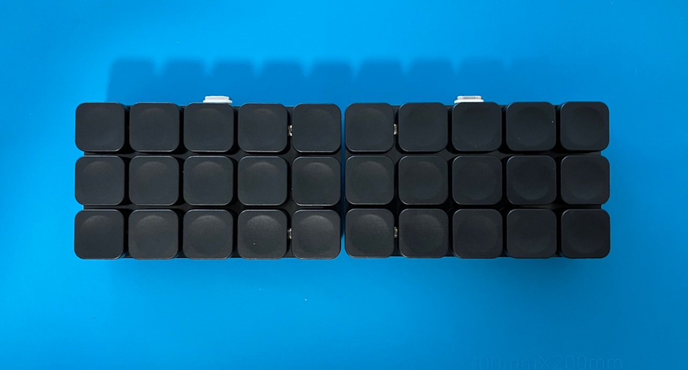
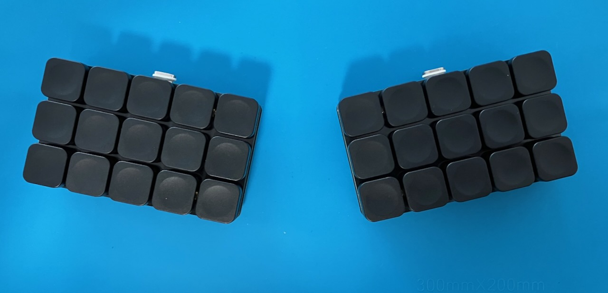
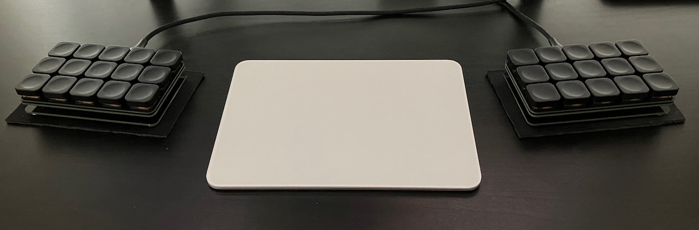

# Briq

This is by far the most comfortable keyboard that I have designed and used! I originally wanted to use this version of the board with Ben Vallacks custom piano layout (with a few extra keys), but desided instead to try and relearn the standard ISRT layout (the only change being the J key) after having seen the gherkin/dilly kb designs and layouts. I did keep some crucial features of the piano layout that worked really well however, namely the index layer switching and upper row moddifiers. Suffice to say I believe this to be my Endgame keyboard due to the amazing feel and comfort, with the additional benefit of having the option to choose between Choc and MX switches.

## Specifications & Info:

- Choc/MX compatible
- Hotswap
- Three-part Keyboard
- Puck/tenting support
- Wireless (only!)
- Keymap [here](https://github.com/kunsteak/keymap-drawer/tree/main/dilly)
- PCB [here](pcb/)
- Custom Dilly-style ZMK repo [here](https://github.com/kunsteak/zmk-config-dilly)
- Custom Piano-style ZMK repo [here](https://github.com/kunsteak/zmk-config-brick)

## Pictures

## Sponsorship

This is another one of my projects that was sponsored by [PCBWay](https://www.pcbway.com). They have kindly provided me with all the PCBs for this keyboard build in a high-quality immersion gold (ENIG) finish.

Although on the pricier side, these PCBs are perfect for an Endgame build, as they look and feel very premium. Both the product and the customer service has been very satisfactory and I will certainly keep ordering from PCBWay in the future.

If you'd like an extra 5$ on your first order when signing up on PCBWay you can use [this](https://pcbway.com/g/dh9XKF) referral link of mine to get started. If you choose to do so, I receive a 10$ coupon from PCBWay and am eternally grateful for your kind gesture.
